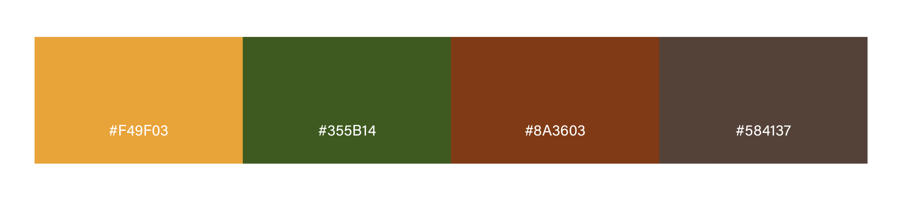
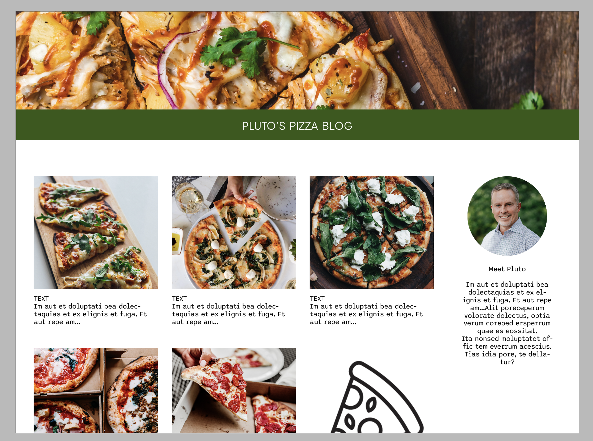
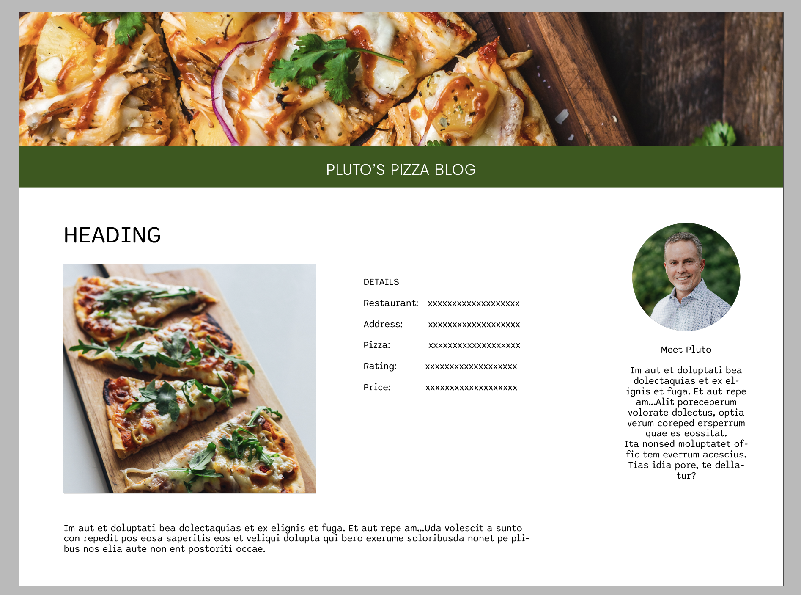

# Pluto's Pizza Blog 

## Project Goals:

Pluto’s Pizza Blog is a personal blog for Pluto Johnsson where he documents and reviews restaurant pizzas that he has tried. The blog is targeted towards other people in the area who share the same interest for food and especially pizza. On the site people can get recommendations for the best pizza in the neighborhood and get a glimpse of Plutos personal life. The link for the live project can be found here - [Pluto's Pizza Blog](https://plutospizza.herokuapp.com/)

A visitor to Easy Eater would be someone who is most likely an adult who enjoys their food and trying new recipes but also wants to save time and effort when deciding what to cook for dinner every night of the week.

#### UX
A visitor to Pluto’s Pizza Blog would most likely be someone who lives in the same city or neighborhood and who enjoys eating at restaurants and especially likes pizza. It could also be someone who is friends or family with Pluto and enjoys reading the blog to keep up with him.

### User Stories

#### Owner Profile
- As a Site Owner I have an account where I can log in and create, edit and delete blog posts.
- As a Site Owner, I can log in and out of my account so that it stays secure.
- As a Site Owner I can see if I am logged in or out so that I know my status.

#### User Profile
- As a New User I can register for an account so that I can comment and like posts.
- As a Site User I have an account where I can log in and like/comment on posts.
- As a Site User, I can log in and out of my account so that it stays secure.
- As a Site user I can see if I am logged in or out so that I know my status.

#### User Navigation
- As a Site User I can immediately easily find the navigation so that I can use the website with ease.
- As a Site User, I can view a list of blog posts so that I can choose which post to read.
- As a Site User, I can click on the blog post I want to read so that I can choose to read the full post and comments left by other users.

#### Post Details
- As a Site User I can see the name and location of the restaurant so that I know where to go if I want to try it myself.
- As a Site User I can see the name of the pizza so that I can order it myself.
- As a Site User I can see an image of the pizza so that the site is more visually appealing and I can make my own judgement of the pizza.
- As a Site User I can see what the price range is for the pizza so that I know if it’s something I’m interested in.

#### About Blog
- As a Site User I can find a summery about who owns the blog, what content it has and why it exists so that I can decide if it’s something I want to read.

#### User stories not yet implemented

The following user stories haven't been made due to time constraints. It is intended that some or all of these user stories will be implemented at a later date. 

- As a Site User I can change the order of the blog posts depending on what I’m looking for.
- As a Site User, I can search and filter blog posts so that I can find what I’m looking for.
- As a Site User i can bookmark a post so that I can easily find it later.
- As a Site uUer I can see a scale of different categories such as crust thickness or cheese amount.

### Design

#### Colour Pallete

The colour pallete on the site was chosen based on the header image, the colours are also often found in food and on pizza
toppings. They were chosen to invoke a fresh feeling for the user as well as have a good contrast to make the site accessible for the user.

#### Imagery
The static images on the the site were chosen to match the colour palette and to give the blog a more personal feeling. The blog post
images are uploaded with the post and should contain a photo of the pizza being reviwed.

#### Fonts
The fonts used are Plus Jakarta Sans and Sono. Sono was chosen for its familiar and playful feeling while still being readable. Plus Jakarta Sans was chosen to contrast Sono and make the logo stand out. The fonts were imported via Google Fonts.

#### Wireframes
The first wireframes were rough sketches made by hand on paper for the layout. (Will insert pictures of this here)

The second wireframes were made in InDesign to see if the colors and fonts would work together. 

## Agile method

To manage the user stories for this project Github project was used. The project board can be found [here](https://github.com/users/lisalindqvist95/projects/3/views/1).

## Data Model

## Testing

## Security Features and Defensive Design

## Features

## Deployment 

This project was depolyed via Heroku from the GitHub repository. See the steps taken below:

### Create Heroku App:
- Log in to [Heroku](https://dashboard.heroku.com/apps)
- Press the "New" button on the main page and choose "Create New App" from the drop-down menu
- Enter the app name and select your region
- Then "Create App"

### Create a database with ElephantSQL
- Log in to [ElephantSQL](https://www.elephantsql.com/)
- Press the button "Create New Instance" i the top right corner
- Give your plan a name and select your plan 
- Press the button "Select Region" and select a data center near you
- Then press the "Review" button
- Check that all your details are correct and press "Create instance"
- Copy the URL database to paste in your GitPod workspace

### Github env.py and settings.py file:
- Create an env.py file in the main directory of your GitPod workspace
- In the env.py file add the DATABASE_URL value and create a chosen SECRET_KEY 
- Go into the settings.py file to import the env.py file, add file paths for both the SECRETKEY and DATABASE_URL (comment out the default database)
- Save your files and make migrations

### Create files / directories
- Create a requirements.txt file in the main directory
- Create a "Procfile" in the main directory and add: gunicorn project-name.wsgi

### Heroku Config Vars
- DATABASE_URL value (copy database from ElephantSQL)
- SECRET_KEY value 
- CLOUDINARY_URL
- PORT = 8000
- DISABLE_COLLECTSTATIC = 1

### Deployment
- Under the deploy tab on Heroku conncet to your GitHub and add your repository
- Deploy at the bottom of the page 
- Click View to view the deployed site.

# Languages

## Frameworks - Libraries - Programs Used

## Credits
