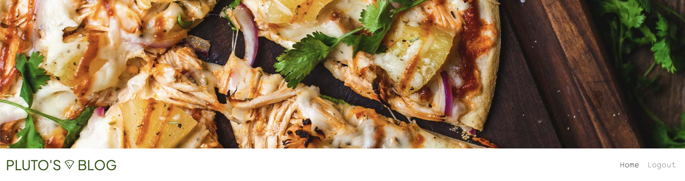

# Pluto's Pizza Blog 

## Project Goals:

Pluto’s Pizza Blog is a personal blog for Pluto Johnsson where he documents and reviews restaurant pizzas that he has tried. The blog is targeted towards other people in the area who share the same interest for food and especially pizza. On the site people can get recommendations for the best pizza in the neighborhood and get a glimpse of Plutos personal life. The link for the live project can be found here - [Pluto's Pizza Blog](https://plutospizza.herokuapp.com/)

A visitor to Easy Eater would be someone who is most likely an adult who enjoys their food and trying new recipes but also wants to save time and effort when deciding what to cook for dinner every night of the week.

#### UX
A visitor to Pluto’s Pizza Blog would most likely be someone who lives in the same city or neighborhood and who enjoys eating at restaurants and especially likes pizza. It could also be someone who is friends or family with Pluto and enjoys reading the blog to keep up with him.

### User Stories

#### Owner Profile
- As a Site Owner I have an account where I can log in and create, edit and delete blog posts.
- As a Site Owner, I can log in and out of my account so that it stays secure.
- As a Site Owner I can see if I am logged in or out so that I know my status.

#### User Profile
- As a New User I can register for an account so that I can comment and like posts.
- As a Site User I have an account where I can log in and like/comment on posts.
- As a Site User, I can log in and out of my account so that it stays secure.
- As a Site user I can see if I am logged in or out so that I know my status.

#### User Navigation
- As a Site User I can immediately easily find the navigation so that I can use the website with ease.
- As a Site User, I can view a list of blog posts so that I can choose which post to read.
- As a Site User, I can click on the blog post I want to read so that I can choose to read the full post and comments left by other users.

#### Post Details
- As a Site User I can see the name and location of the restaurant so that I know where to go if I want to try it myself.
- As a Site User I can see the name of the pizza so that I can order it myself.
- As a Site User I can see an image of the pizza so that the site is more visually appealing and I can make my own judgement of the pizza.
- As a Site User I can see what the price range is for the pizza so that I know if it’s something I’m interested in.

#### About Blog
- As a Site User I can find a summery about who owns the blog, what content it has and why it exists so that I can decide if it’s something I want to read.

#### User stories not yet implemented

The following user stories haven't been made due to time constraints. It is intended that some or all of these user stories will be implemented at a later date. 

- As a Site User I can change the order of the blog posts depending on what I’m looking for.
- As a Site User, I can search and filter blog posts so that I can find what I’m looking for.
- As a Site User i can bookmark a post so that I can easily find it later.
- As a Site uUer I can see a scale of different categories such as crust thickness or cheese amount.

### Design

#### Colour Pallete

The colour pallete on the site was chosen based on the header image, the colours are also often found in food and on pizza
toppings. They were chosen to invoke a fresh feeling for the user as well as have a good contrast to make the site accessible for the user.

#### Imagery
The static images on the the site were chosen to match the colour palette and to give the blog a more personal feeling. The blog post
images are uploaded with the post and should contain a photo of the pizza being reviwed.

#### Fonts
The fonts used are Plus Jakarta Sans and Sono. Sono was chosen for its familiar and playful feeling while still being readable. Plus Jakarta Sans was chosen to contrast Sono and make the logo stand out. The fonts were imported via Google Fonts.

#### Wireframes
The first wireframes were rough sketches made by hand on paper for the layout. (Will insert pictures of this here)

The second wireframes were made in InDesign to see if the colors and fonts would work together. 

## Agile method

To manage the user stories for this project Github project was used. The project board can be found [here](https://github.com/users/lisalindqvist95/projects/3/views/1).

## Data Model

This Project is based around Object-Oriented Programming.

It is built with Django’s Class-Based Generic Views and Django AllAuth is used as the authentication system.

The project has a Post model wich allows the admin to create blogposts and a Comment model which allows users to comment on posts.

## Testing

### User Story Testing

As a Site Owner I can manage comments so that I can keep my blog a safe and respectful place
 - The comments have to be approved by the site owner before they appear on the blog.

As a Site Owner I have an account where I can log in and create/edit and delete blog posts
 - Only the superuser can log in to the admin page and create, edit and delete blog posts.

As a Site Owner I can log in and out of my account so that it stays secure.
 - There is a login/out button in the navigation bar at the top. 

As a Site Owner I can see if I am logged in or out so that know my status
 - The navigaton bar changes depending on if the user is logged in or not, a loggen in user has the option to log out and a logged out user has the option to log in or sign up.

As a New User I can register for an account so that I can comment and like posts
 - Only logged in users can comment and like posts, there is an option to sign up in the navigation bar for a logged out user. 

As a Site User I have an account where I can log in and like/comment on posts 
 - A user with an account can log in an like/comment on posts, the can also edit and delete their comments.

As a Site User I can find a summery about who owns the blog, what content it has and why it exists so that I can decide if it’s something I want to read
 - The blog has a sidebar with an about section so that the user can easaly find info about the owner.

As a Site User I can see what the price range is for the pizza so that I know if it’s something I’m interested in
 - Every post contains information about the price-range, which is part of the post model.

As a Site User I can see the name and location of the restaurant so that I know where to go if I want to try it myself.
 - Every post contains information about the location, which is part of the post model.

As a Site User I can see the name of the pizza so that I can order it myself
 - Every post contains information about the pizza, which is part of the post model.

As a Site User I can log in and out of my account so that it stays secure
 - Login and out function is located in the navigation bar so that the user easily can log out. 

As a Site User I can see if I am logged in or out so that I know my status
 - The navigaton bar changes depending on if the user is logged in or not, a loggen in user has the option to log out and a logged out user has the option to log in or sign up.

As a Site User I can immediately easily find the navigation so that I can use the website with ease
 - The navigation bar is placed at the top of the blog for the user to easily find. 

As a Site User I can view a list of blog posts so that I can choose which post to read
 - The homepage is pagineted to show a list of posts with images and titles for the user to choose between. 

As a Site User I can click on the blog post I want to read so that can choose to read the full post and comments left by other users
 - If the users clicks on a post on the home-page it will take them to the blogpost in the post-detail view.

### Validator Testing

#### HTML
All HTML pages were run through the [W3C HTML Validator](https://validator.w3.org/) and all errors where corrected. 

#### CSS

The CSS passed through the official [W3C CSS Validator](https://jigsaw.w3.org/css-validator/).

#### Python 

All Python files passed through [Pep8](http://ww1.pep8online.com/).

### Browser Testing
 - The website is tested on the commonly used browsers: Chrome, Safari, Edge, Firefox and Opera
 - All features worked on the tested browsers

### Device Testing
 - The website is responsive so that it can be used on different screen-sizes
 - The responsiveness was tested using DevTools

### Manual Testing

| **Element**                                 | **Action** | **Expected Result**                                         | **Pass/Fail** |
|---------------------------------------------|------------|-------------------------------------------------------------|---------------|
| _NavBar_                                    |            |                                                             |               |
|                                             |            |                                                             |               |
| Logo                                        | Click      | Redirect to homepage                                        | Pass          |
| Home Link                                   | Click      | Redirect to homepage                                        | Pass          |
| Log out link                                | Display    | Not visible for logged out user                             | Pass          |
| Log out link                                | Click      | Log out page                                                | Pass          |
| Log out confirmation: yes                   | Click      | Log out user                                                | Pass          |
| Log in link                                 | Display    | Not visible for logged in user                              | Pass          |
| Log in link                                 | Click      | Sign in page                                                | Pass          |
| Sign in: Correct user info                  | Click      | Sign in user                                                | Pass          |
| Sign in: Incorrect user info                | Click      | Don't sign in user                                          | Pass          |
| Sign up                                     | Display    | Not visible for logged in user                              | Pass          |
| Sign up: Correct user info                  | Click      | Sign up user                                                | Pass          |
| Sign up: Incorrect user info                | Click      | Display issue, do not sign up user                          | Pass          |
|                                             |            |                                                             |               |
| _Footer_                                    |            |                                                             |               |
|                                             |            |                                                             |               |
| Social meda links                           | Click      | Open in new tab                                             | Pass          |
| Social meda links                           | Click      | Open correct webpage                                        | Pass          |
|                                             |            |                                                             |               |
| _Comments_                                  |            |                                                             |               |
|                                             |            |                                                             |               |
| Leave a comment - logged in user            | Display    | Form to leave a comment                                     | Pass          |
| Leave a comment - logged out user           | Display    | No form to leave a comment                                  | Pass          |
| Submit comment                              | Click      | Show message that comment is waiting for approval           | Pass          |
| Edit comment - author                       | Display    | Show button to edit comment                                 | Pass          |
| Edit comment - author                       | Click      | Edit comment form                                           | Pass          |
| Edit comment form - Update button           | Click      | Update comment and redirect to post detail                  | Pass          |
| Edit comment form - Cancel button           | Click      | Redirect to post detail, leave comment unedited             | Pass          |
| Delete comment - author                     | Display    | Show button to delete comment                               | Pass          |
| Delete comment form - delete button         | Click      | Delete comment and redirect to post detail                  | Pass          |
| Delete comment form - cancel button         | Click      | Redirect to post detail, keep comment                       | Pass          |
| Edit comment - Not author                   | Display    | Don't show                                                  | Pass          |
| Delete comment - Not author                 | Display    | Don't show                                                  | Pass          |
|                                             |            |                                                             |               |
| _Homepage_                                  |            |                                                             |               |
|                                             |            |                                                             |               |
| Pagination                                  | Display    | Show only 6 posts per page                                  | Pass          |
| Post detail                                 | Click      | Redirect to post                                            | Pass          |
|                                             |            |                                                             |               |
| _Likes_                                     |            |                                                             |               |
|                                             |            |                                                             |               |
| Like button - logged in user - unliked post | Click      | Like post                                                   | Pass          |
| Like button - logged in user - liked post   | Click      | Unlike post (a post cannot be liked by the same user twice) | Pass          |
| Like button - logged out user               | Click      | Nothing, user have to be logge in to like a post            | Pass          |

### Bugs

#### Placeholder image not showing
 - The placeholder image was not showing, it was because it had been updated in the cloudinary storage which updates its unique link. It worked when the code was updated with the new link. 

#### NoReverseMatch 
 - NoReverseMatch came up as an error when trying the edit comment button, by checking [Stack Overflow](https://stackoverflow.com/questions/38390177/what-is-a-noreversematch-error-and-how-do-i-fix-it) the issue could be debugged and a typo in the views file was found. 

#### Layout in PostDetail
 - The layout in PostDetail was accidentally changed so that the comments and likes section moved to where it was not supposed to be, it was fixed by going through the code and fixing the syntax errors. 

### Unfixed bugs

## Security Features and Defensive Design

### User Authentication
Django's UserPassesTestMixin is used so that only users who created the comment edit/delete it.

### Form Validation
The form won't submit if it contains empty or invalid data.

### Database Security
An env.py file is used to store the database url and secret key to prevent unwanted connections to the database.

Cross-Site Request Forgery (CSRF) tokens are used on the forms on the site. 

## Features

### Header

 - The header contains an image that matches the colors on the website and informs the user of what the main content of the website is about.

#### Logo

 - The logo is meant to inform the user of the websites content and owner without distracting from this being a simple blog.

#### Navigation
 
- The navigationbar changes depending on if the user is logged in or not
- A logged out user i able to log in or create an account

### Footer

 - The footer contains social media links so that users can find out more about the owner and follow him on other platforms
 - The links open in a new tab so that the user isn't removed from the blog

### Pagination

 - The homepage is paginetad to show 6 posts at a time to make it easier for the user to see the posts and not get overwhelmed
 - More than 6 posts will result in more pages for the user to click through
 - The posts are displayed based on when they where created, from newest to oldest

### About 

 - The about section is placed in a sidebar so that it is always easy for the user to find

### User Account

#### Sign up

 - A logged out user can sign up for an account
 - If they already have an account they can click the "sign in" text above
 - Empty or invalid input will notify the user

#### Sign in

 - A logged out user can sign in to their account
 - Empty or invalid input will notify the user

#### Sign out 

 - A logged in user can choose to sign out

### Post detail

 - The post details contains the blogpost with information about the restaurant, pizza, pricing and rating
 - The post also contains an image 
 - Under the post users can like the post and the number of likes is displayed

### Comments 

 - Comments are dsiplayed underneath the blog post

#### Edit 

 - The creator of the comment can choose to edit the comment they have posted once it has been approved

#### Delete

 - The creator of the comment can choose to delete the comment they have posted once it has been approved

## Deployment 

This project was depolyed via Heroku from the GitHub repository. See the steps taken below:

### Create Heroku App:
- Log in to [Heroku](https://dashboard.heroku.com/apps)
- Press the "New" button on the main page and choose "Create New App" from the drop-down menu
- Enter the app name and select your region
- Then "Create App"

### Create a database with ElephantSQL
- Log in to [ElephantSQL](https://www.elephantsql.com/)
- Press the button "Create New Instance" i the top right corner
- Give your plan a name and select your plan 
- Press the button "Select Region" and select a data center near you
- Then press the "Review" button
- Check that all your details are correct and press "Create instance"
- Copy the URL database to paste in your GitPod workspace

### Github env.py and settings.py file:
- Create an env.py file in the main directory of your GitPod workspace
- In the env.py file add the DATABASE_URL value and create a chosen SECRET_KEY 
- Go into the settings.py file to import the env.py file, add file paths for both the SECRETKEY and DATABASE_URL (comment out the default database)
- Save your files and make migrations

### Create files / directories
- Create a requirements.txt file in the main directory
- Create a "Procfile" in the main directory and add: gunicorn project-name.wsgi

### Heroku Config Vars
- DATABASE_URL value (copy database from ElephantSQL)
- SECRET_KEY value 
- CLOUDINARY_URL
- PORT = 8000
- DISABLE_COLLECTSTATIC = 1

### Deployment
- Under the deploy tab on Heroku conncet to your GitHub and add your repository
- Deploy at the bottom of the page 
- Click View to view the deployed site.

# Languages

- Python
- HTML
- CSS
- Javascript

## Frameworks & Libraries Used

 - [Django](https://www.djangoproject.com/): Main framework used for the project
 - [Django-allauth](https://django-allauth.readthedocs.io/en/latest/installation.html): Authentication library used for the project 
 - [PostgreSQL](https://www.postgresql.org/:) Used as database
 - [Heroku](https://id.heroku.com/login): Used for deployement
 - [Chrome Dev Tools](https://developer.chrome.com/docs/devtools/): Used to test responsiveness
 - [Font Awesome](https://fontawesome.com/): Used for icons
 - [GitHub](https://github.com/): Used for version control and agile tool 
 - [Google Fonts](https://fonts.google.com/): Used for fonts
 - [W3C](https://www.w3.org/): Used to validate HTML & CSS 
 - [PEP8 Online](http://ww1.pep8online.com/): used to validate Python code
 - [Summernote](https://summernote.org/): Editor to allow users to edit their posts
 - [Crispy Forms](https://django-crispy-forms.readthedocs.io/en/latest/): used for Django Forms
 - [Cloudinary](https://cloudinary.com/): Image hosting service 
 - [Bootstrap](https://getbootstrap.com/docs/4.6/getting-started/introduction/): CSS Framework for responsiveness and styling
 - [Tables Generator](https://www.tablesgenerator.com/markdown_tables): Used to create markdown table

## Credits
- [W3Schools](https://www.w3schools.com/)
- [Django Docs](https://docs.djangoproject.com/en/4.0/) 
- [Bootstrap](https://getbootstrap.com/docs/4.6/getting-started/introduction/)
- [Stack Overflow](https://stackoverflow.com/)
- [Code Institute - Blog Walkthrough Project](https://github.com/Code-Institute-Solutions/Django3blog)
- [AliOKeeffe](https://github.com/AliOKeeffe/PP4_My_Meal_Planner) - Easy Eater Project
- [Unsplash](https://unsplash.com/)